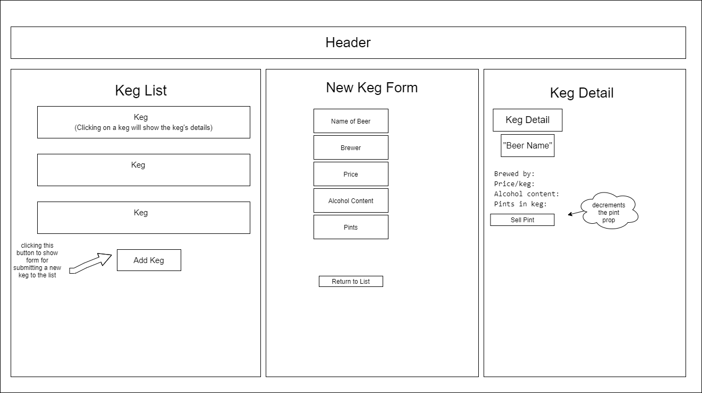

# Tap Room

### Independent project for Epicodus by Dani Renner



## Description

This application allows users to create and update a list of kegs.

## Technologies Used

* React
* JSX
* CSS
* npm
* Babel
* MDB
* git
* Redux

## Installation Instructions
1. Navigate to the desired directory where you would like to clone the project.

2. Once you have chosen your desired directory, clone the github repo using the version control tool `git` (<a href="https://www.learnhowtoprogram.com/introduction-to-programming/getting-started-with-intro-to-programming/git-and-github">download instructions</a>). Type the following command into your terminal:
```bash
$ git clone https://github.com/dani-renner/tap-room.git
```
3. Open the project in VSCode by typing the following in your terminal:

``` bash
$ code .
```
_**Note:** VSCode is a code editing software. If you don't already have it, you can download it <a href="https://code.visualstudio.com/">here</a>_

## Available Scripts

In the project directory, you can run:

### `npm start`

Runs the app in the development mode.\
Open [http://localhost:3000](http://localhost:3000) to view it in the browser.

The page will reload if you make edits.\
You will also see any lint errors in the console.

### `npm run build`

Builds the app for production to the `build` folder.\
It correctly bundles React in production mode and optimizes the build for the best performance.

The build is minified and the filenames include the hashes.\
Your app is ready to be deployed!

See the section about [deployment](https://facebook.github.io/create-react-app/docs/deployment) for more information.

## Known Bug

Decrease Pint function for selling pints is broken right now, as I am working on handling state with redux.

## License
> [MIT](https://opensource.org/licenses/MIT) 
> Dani Renner &copy; 2021  

## Contact Information

Reach Dani via <a href="https://www.linkedin.com/in/dani-renner/" target="_blank">LinkedIn</a> or <a href="mailto:danijrenner@gmail.com" target="_blank">email</a></li>.  

